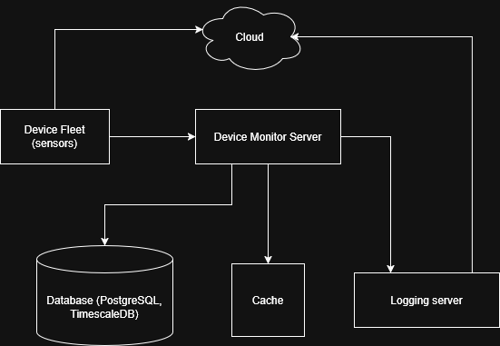

# SafelyYou Coding Challenge: Monitoring the Fleet <!-- omit in toc -->

This repository contains Benjamin Low's (me) submission for SafelyYou's Fleet Management Simple Metrics Server. Please excuse the name as my initial idea was that an actual production plan would be to use MQTT to send stats to the some place like AWS IoT Core, but that idea ended up being scrapped.

## Table of Contents <!-- omit in toc -->
- [Quickrun](#quickrun)
- [Run the compiled binary](#run-the-compiled-binary)
- [Results](#results)
- [Time taken](#time-taken)
- [Runtime complexity](#runtime-complexity)
  - [POST /devices/{device\_id}/heartbeat](#post-devicesdevice_idheartbeat)
  - [POST /devices/{device\_id}/stats](#post-devicesdevice_idstats)
  - [GET /devices/{device\_id}/stats](#get-devicesdevice_idstats)
- [Space complexity](#space-complexity)
- [Future considerations](#future-considerations)
  - [Adding more metrics](#adding-more-metrics)
  - [Deployment](#deployment)
  - [Testing](#testing)
  - [Security](#security)
  - [Possible alpha prototype design](#possible-alpha-prototype-design)
  - [Cloud](#cloud)
  - [Device fleet](#device-fleet)
  - [Device Monitor Server](#device-monitor-server)
  - [Database](#database)
  - [Cache](#cache)
  - [Logging server](#logging-server)
- [AI use](#ai-use)
  - ["Give me a production ready folder structure for an HTTP server along with some explanation for what is stored in them"](#give-me-a-production-ready-folder-structure-for-an-http-server-along-with-some-explanation-for-what-is-stored-in-them)
  - ["How do I exit out of a Go HTTP server properly"](#how-do-i-exit-out-of-a-go-http-server-properly)
  - ["How do I get the status code out of the http.ResponseWriter"](#how-do-i-get-the-status-code-out-of-the-httpresponsewriter)
  - ["Is there a way to store time in an array such that someone can search up a time range?"](#is-there-a-way-to-store-time-in-an-array-such-that-someone-can-search-up-a-time-range)
  - [Misc](#misc)


## Quickrun

To run the server without building:

```bash
go run ./cmd/server
```

Then run the device simulator which would output the `results.txt` file in the same directory as your simulator executable.

## Run the compiled binary

1. Compile to executable binary.

    **Windows**
    ```bash
    go build -o bin/device_check_mqtt.exe ./cmd/server
    ```

    **Linux/Mac**
    ```bash
    go build -o bin/device_check_mqtt ./cmd/server
    ```

2. Execute the file.

    **Windows**
    ```bash
    ./bin/device_check_mqtt.exe
    ```

    **Linux/Mac**
    ```bash
    ./bin/device_check_mqtt
    ```

3. Run the device simulator which would output the `results.txt` file in the same directory as your simulator executable.

## Results

Within the repository contains the results.txt file output from the device-simulator, which can be found [here](./results.txt).

The results should be accurate to what is expected, but I am not sure if I got lucky with them as they are one to one the same.

## Time taken

The following is a breakdown of the time I took to finish the assignment.
- Wednesday: 2 hours. Spent on figuring out how to structure the project, how it would work in an actual production setting, and then implementing a bare server.
- Sunday: 8 hours. Spent finishing up the assignment. Created the endpoints according to the instructions. Tested and made sure it worked correctly. Added a logging middleware for the the endpoints. Spent a lot of time on the README.

I would say the most difficult part for me was figuring out a proper design for the project. Despite getting some help from Claude on how to structure the project, I was still lost in the sauce trying to figure out why certain things are arranged the way they are. Once I started implementing and playing around with the implementation, I figured it out eventually. I do admit that I might have overdesigned it.

Second most difficult part was figuring out security implementation for the server. I am not sure how much SafelyYou values offline-first functionality, but if I had to take that into account, then I really had to dig to figure something out when it comes to local communication.

Third most difficult was looking at the OpenAPI contracts to ensure that what I implemented was correct. Although it wasn't difficult, it did take the longest time. I could have possibly used Claude Code or copy pasted the code to the chat bot for faster checks, but wasn't too sure on SafelyYou's policy on handing LLMs large amounts of code, so I did it manually.

## Runtime complexity

The following would be the runtime complexity of the endpoints.

### POST /devices/{device_id}/heartbeat

As it only looks up the device in a hashmap then inserts the heartbeat into the storage, it will only be O(1).

### POST /devices/{device_id}/stats

It will be O(1) similar to the heartbeat endpoint above, a device lookup in the hashmap then appending the time to the list of saved upload times. Could potentially be O(n) (where n is the total number of times recorded) when the slice goes over capacity and a new larger sized slice is created to store the times, but that should not happen very often.

### GET /devices/{device_id}/stats

The lookup for heartbeats for uptime should be O(1) as I only store the FirstHeartbeat and LastHeartbeat for the device, plus the total heartbeat count. There's no need for any length lookups as I stored the values needed in the formula to calculate the uptime.

To retrieve the average upload time would take O(n) though, where n is the length of upload times recorded. It needs to loop through all the recorded upload times and then sum them up so that it can be averaged out in the end. This could turn into O(1) runtime if instead of storing the times in a slice, the server stores `totalUploadTime` and `uploadTimeCount`, where every time the stats POST endpoint is called, it adds the new upload time to the existing `totalUploadTime` and increments the  `uploadTimeCount`. That would only require the server to just execute `totalUploadTime` / `uploadTimeCount` for average upload time. But as the `Calculating Average Upload Time` formula requests for `arrayOfUploadTimeDurations`, I didn't implement that solution.

Combining them, it would be O(1 + n), which would be O(n).

## Space complexity

Should be O(d + t) where `d` is the number of devices recorded and `t` is the number of upload times recorded. 

## Future considerations

### Adding more metrics

It should be straightforward to add more metrics to the current design.

For example, we want to add a new type of metric called "location" where you would want to track certain sensors' locations to keep track of their placements. The following steps would be instructions to add the new metric:

1. Add a new file that contains the definition of the location endpoints' DTO bodies, called `location_dto.go` in `internal/model`.
2. Define any storage operation methods that you would like to add for location in the `DeviceStorageStore` interface in `internal\store\store.go`.
3. Implement the storage operation code for location into all the storage structs that implements `DeviceStorageStore` (e.g. `InMemoryStore` in `internal\store\in_memory.go`).
4. For updating data models, if still using in-memory storage, update the `Device` struct so that it can record location. If SQL database, then create a new table for location storage.
5. Add new methods to `internal\service\device_service.go` that can handle location business logic for the HTTP handlers.
6. Add new handlers in a file in `internal\handler` called `location.go` which implements the HTTP endpoint logic.
7. Add the handler to the router in `internal\router\router.go`.

### Deployment

In most scenarios where I've seen Go deployed, Docker containers are usually used. I didn't implement them in this assignment as I thought it could be overkill, but in a production scenario, I would probably do so.

Set up Github Actions so that the Docker image is pushed to Github's container registry or AWS ECR, which you can then use Kubernetes to schedule an update for the client's device for the new image. Note that this is quick brainstorming as I have not really used Kubernetes before, and only know the gist of it.

### Testing

As I didn't have much time left, I would consider adding unit tests for all of the logic files, besides main and the model files. Integration tests would be great to add too, as it would test how the actual server would work when endpoints are called.

### Security

The simplest secrity measure would be to implement TLS for HTTPS so that plain-text is not visible between the communication of the device to server.

The next step would be to add authorization for the device to communicate with the server. One problem is that besides not allowing anyone to call the endpoints of the server, devices should also not be allowed to insert or read any data not related to them. For example, device 1 should not be able to insert heartbeats for device 2. In a simple solution, I would have just used JWT as that would be the easiest way to handle RBAC, but I read that the better solution for IoT systems would be using mTLS for authorization, which could also handle RBAC.

Another way to secure the server would be rate limits, but I didn't implement that as I wasn't sure if the device simulator would be blocked.

If we're going to be using a database, there are multiple options that we could implement. I am going to assume that the database is local within the customer's system. One way would be to introduce a firewall in the device containing the database, such that it only accepts requests from the IP that is hosting the server. If the database is in a Docker container with the device monitor server, the networks could be restricted such that the database only allows internal access, which allows only the server to communicate with it.

### Possible alpha prototype design

In my mind, this is how I would design the system.



### Cloud

General abstraction for any services we use in our prefered cloud services, like databases, IoT core, virtual instances, data buckets, etc.

### Device fleet

This group will contain all the devices, which includes sensors, servers and switches. These devices will be communicating with other devices as well, but to the knowledge of the device monitor server, it only uploads data to the cloud and uploads its statistics to the device monitor server.

### Device Monitor Server

This is what this repository contains. As I am not sure what the requirements are for throughput, a single server would suffice in a simple scenario. If needed, multiple servers can be deployed to handle more requests and these server would then be put behind a load balancer for request distribution. This would also allow for rolling deployments, which allows for servers to be updated one by one. If we had just one server, then an update would shut down the sole server, which would mean data loss.

### Database

All data that passes though the device monitor will be stored here. This would allow for better searches like time ranges in the future. Apparently TimescaleDB is a good solution if most of the READs are time based, but I haven't done too much research on why that is. Otherwise, PostgreSQL would be a good solution. Not too sure about SQLite as I would predict that WRITEs would be more frequent than READs, and SQLite doesn't do too well with a lot of WRITEs.

### Cache

If READ frequency is really high, a cache can be implemented so that the longer lookups during database operations could be avoided as much as possible.

### Logging server

Instead of the devices calling the GET endpoint of the device monitor server, I would imagine it would be a separate server/device that calls those endpoints to aggregate the stats and send them off to the cloud or some other service for logging and data storage (e.g. average stats in the month of January). A message queue could be implemented to handle the logging output to the cloud, which can ensure that data is persisted if the connection is broken between the cloud and the server. This could either be handled by something like Kafka, or for an MQTT solution, some MQTT broker like Mosquitto with QoS 1 messages. Messages from these services once they reach the cloud will then be handled accordingly.

This could also help health check the device monitor server if needed.

## AI use

I had some AI assistance with this assignment. I didn't use any coding assistants like Claude Code, but I did prompt the Claude chatbot to help me figure out design ideas and certain issues that I had. The following are prompts that I gave to Claude to help me out.

### "Give me a production ready folder structure for an HTTP server along with some explanation for what is stored in them"

I have used Go before in my current position, but I needed to make sure that it was something production ready and extensive as most of my built Go applications were really short.

### "How do I exit out of a Go HTTP server properly"

Usually I would have done the following line at the end:

```go
if err := server.ListenAndServe(); err != nil && err != http.ErrServerClosed {
    slog.Error("Server failed", "error", err)
    os.Exit(1)
}
```

But I wanted to make sure that that was the correct method of exiting out when the user terminates the server manually.

### "How do I get the status code out of the http.ResponseWriter"
 
Needed to know what the solution was to get the status code out of the response. Found that the solution was to create a struct wrapper around http.ResponseWriter and create a WriteHeader method for it.

### "Is there a way to store time in an array such that someone can search up a time range?"

Just in case if ever the stats GET endpoint is to be expanded such that the a time range be requested for stats, just wanted to know what my options were if not a SQL database and if I could implement that with my current implementation if in-memory storage.

### Misc

The other prompts are simple questions to ask what am I doing wrong or is there something that Go provides that I don't have to code manually, like the following:
- "Is there something Go has that can compile a list into it's average?"
- "I am getting an error when using new() with slices. What are my options to copy slices in Go?"